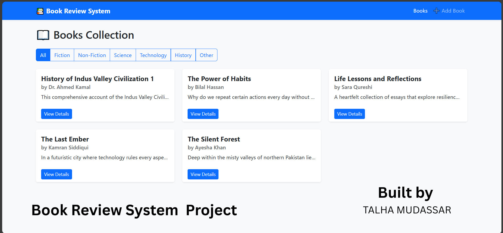

# 📚 Book Management System using Django

## 📸 Project Screenshot

## 📝 Description
This is a **Book Management System** built with Django that allows users to manage a collection of books.  
Users can **create, view, update, delete, and filter books** based on their genre. The project also provides detailed book information, including **author, description, ISBN, publication date, and ratings**.

## 🚀 Features
- ➕ Add new books with details (title, author, description, genre, ISBN, publication date)
- ✏️ Edit book details
- ❌ Delete books
- 📖 View book details with genre and description
- 🔍 Filter books by genre (Fiction, Non-Fiction, Science, Technology, History, Other)
- ✅ Flash messages for success and error handling
- 📅 Automatic timestamps for created and updated books
- 🎨 Responsive Bootstrap-based UI

## 🛠️ Installation
1. Clone the repository:
   git clone https://github.com/TalhaMudassar/DJANGO-PROJECTS/tree/main/bookreview/bookreview
Navigate into the project directory:

cd book-management-django
Create and activate a virtual environment:

python -m venv env
source env/bin/activate   # On Linux/Mac
env\Scripts\activate      # On Windows
Install dependencies:

pip install django
Apply migrations:

python manage.py makemigrations
python manage.py migrate
Create a superuser (for admin panel):

python manage.py createsuperuser
Run the development server:

python manage.py runserver

Open the app in your browser at:
👉 http://127.0.0.1:8000/
Add new books using the form.
Browse the list of books and filter by genre.
View details of individual books.
Edit or delete books as needed.