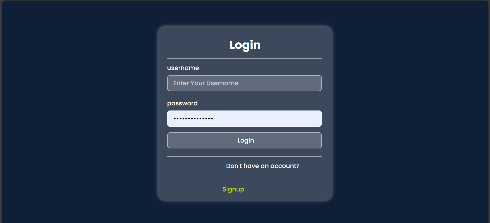
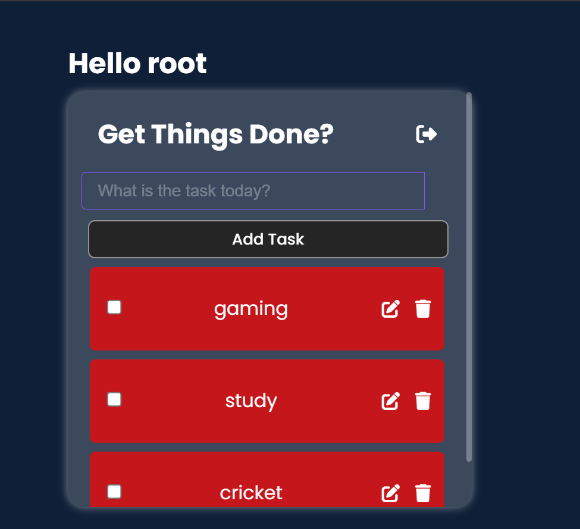

# Multi User Todo Application using Django

## Project Screenshots

## Description
This project is a multi-user todo application built using Django. It allows users to create, manage, and track their tasks in a collaborative environment. 

## Features
- User registration and authentication
- Create, edit, and delete tasks
- Assign tasks to specific users
- Mark tasks as completed
- Filter tasks based on status, priority, etc.

## Installation
1. Clone the repository: `git clone https://github.com/TalhaMudassar/DJANGO-PROJECTS.git`
2. Navigate to the project directory: `cd todotasks`
3. Install dependencies: `pip install django`
4. Set up the database: `python manage.py makemigrations` and `python manage.py migrate`
5. Create a superuser for admin access: `python manage.py createsuperuser`
6. Start the development server: `python manage.py runserver`

## Usage
1. Access the application through your browser at `http://localhost:8000/`
2. Register as a new user or log in with an existing account
3. Add and manage your todo tasks
4. Collaborate with other users by assigning tasks to them

