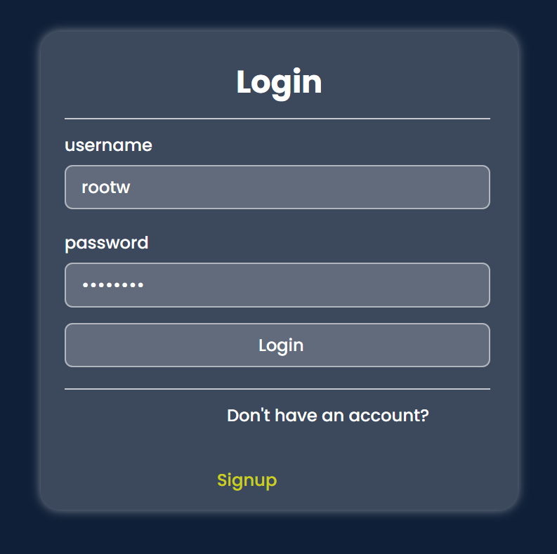

# Multi User Todo Application using Django

## Project Screenshots
  
  
  
  

## Description
This project is a **multi-user todo application** built using **Django**.  
It allows users to create, manage, and track their tasks in a collaborative environment.

## Features
- User registration and authentication  
- Create, edit, and delete tasks  
- Assign tasks to specific users  
- Mark tasks as completed  
- Filter tasks based on status, priority, etc.  

## Installation
Follow these steps to set up the project locally:
1. Clone the repository:  
   ```bash
   git clone https://github.com/TalhaMudassar/DJANGO-PROJECTS.git
Navigate to the project directory:
cd todotasks
Install dependencies:
pip install django
Set up the database:
python manage.py makemigrations
python manage.py migrate
Create a superuser for admin access:
python manage.py createsuperuser
Start the development server:


python manage.py runserver
Usage
Open your browser and go to: http://localhost:8000/
Register as a new user or log in with an existing account
Add and manage your todo tasks
Collaborate with other users by assigning tasks to them
Future Enhancements
Add due dates and reminders for tasks

Implement task categories and tags
Add progress tracking with charts
Create a mobile-friendly responsive UI

👨‍💻 Author: Talha Mudassar
📂 Repository: DJANGO-PROJECTS

