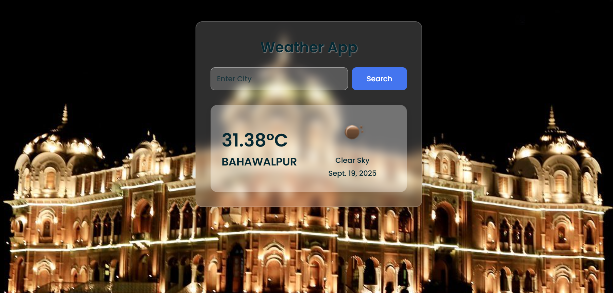

# Weather App using Django

## Project Screenshots
  

## Description

This project is a weather application built using Django. It allows users to search for a city and view real-time weather details such as temperature, conditions, and icons, along with a dynamic background image related to the city.

## Features

Search weather by city name
Real-time temperature and weather conditions
Weather icons for clear, cloudy, rainy, etc.
Dynamic background images for each city (with a default fallback)
Error handling for invalid or unavailable cities

## Installation
1. Clone the repository: `git clone https://github.com/TalhaMudassar/DJANGO-PROJECTS.git`
2. Navigate to the project directory: `cd weather`
3. Install dependencies: `pip install django`
4. Start the development server: `python manage.py runserver`

## Usage
1. Access the application through your browser at `http://localhost:8000/`
2. Register as a new user or log in with an existing account
